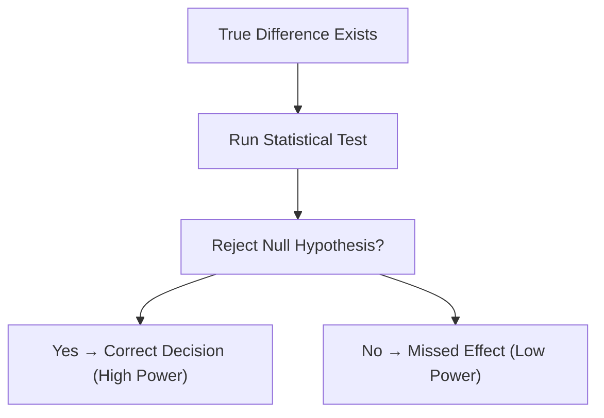
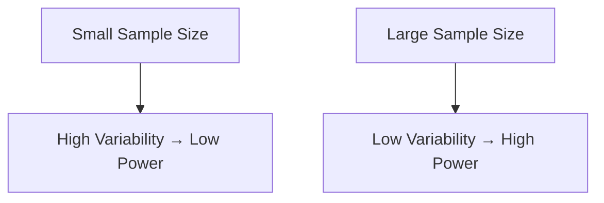
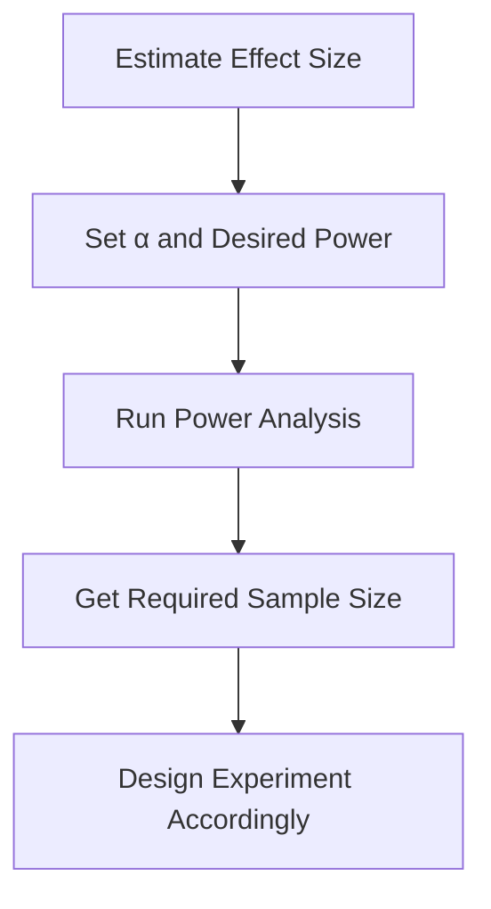

# Understanding Statistical Power

---

## Introduction

**Statistical Power** helps us understand how likely our test is to correctly
detect a real effect.  
In this StatQuest, Josh Starmer explains it using an example of **mouse weights
on two diets** — a **special diet** and a **normal diet**.

---

## Concept of Statistical Power

Let’s start by comparing two distributions:

- Left — mice on a **special (weight-loss) diet**
- Right — mice on a **normal diet**

When the distributions are **far apart**, it’s easy to see that the special diet
leads to lower weights.

If we collect samples and compare means, we might get:

$$
p = 0.0004
$$

Since this is less than 0.05, we **reject the null hypothesis** that both groups
came from the same population.

If we repeated this many times, we would usually get similar results — meaning
we’d **correctly reject the null hypothesis** most of the time.

✅ **Power** = Probability of correctly rejecting the null hypothesis.

---

## Definition of Statistical Power

> **Power** is the probability that a statistical test will correctly reject the
> null hypothesis when it is false.

It’s equivalent to the probability of correctly obtaining a **small p-value**
when a real effect exists.

---

## When Power Doesn’t Apply

If both distributions are **identical**, meaning there is **no real
difference**, then the null hypothesis is true — and there’s nothing to
“correctly reject.”

Thus, the concept of _power_ only applies **when a true difference exists**.

---

## Overlap and Statistical Power

Now imagine the special diet is only **slightly** effective. The two
distributions overlap more heavily.

If we measure three mice in each group, we might get:

$$
p = 0.34
$$

That’s **not significant**, even though the groups are truly different. If we
repeat this experiment many times, most tests will fail to detect a difference
(low power).

But sometimes, just by random chance, we’ll get non-overlapping samples → small
p-value → correct rejection of the null hypothesis.

✅ **Conclusion**: Greater overlap and smaller sample size → **Lower Power**.

---

## Increasing Power by Increasing Sample Size

The **good news**: we can always increase power by collecting more data.

When we increase sample size:

- The mean estimates become more precise.
- The overlap between sampling distributions decreases.
- The test is more likely to correctly detect real effects.

---

## Power Analysis

A **Power Analysis** tells us how many samples we need to achieve adequate power
(usually 80% or higher).

### Key Idea

| Parameter                  | Meaning                                            |
| -------------------------- | -------------------------------------------------- |
| **Effect Size**            | Expected magnitude of difference between groups    |
| **Significance Level (α)** | Usually 0.05                                       |
| **Desired Power (1 - β)**  | Probability of detecting a real effect (e.g., 0.8) |
| **Sample Size (n)**        | Number of observations required                    |

---

### Example Flow

---

## Summary

| Concept               | Explanation                                                   |
| --------------------- | ------------------------------------------------------------- |
| **Statistical Power** | Probability of correctly rejecting the null hypothesis        |
| **High Power**        | When true difference is large or sample size is big           |
| **Low Power**         | When overlap is large or sample size is small                 |
| **Increase Power By** | Increasing sample size, reducing noise, improving measurement |
| **Power Analysis**    | Calculates required sample size for desired power level       |

---

> **Key Takeaway:** Power reflects the reliability of your experiment to detect
> true effects. Plan for sufficient sample size using power analysis to avoid
> inconclusive results.

---

<iframe width="100%" height="615" src="https://www.youtube.com/embed/Rsc5znwR5FA?si=7r5SPGc2qmMcWMtR" title="YouTube video player" frameborder="0" allow="accelerometer; autoplay; clipboard-write; encrypted-media; gyroscope; picture-in-picture; web-share" referrerpolicy="strict-origin-when-cross-origin" allowfullscreen></iframe>
