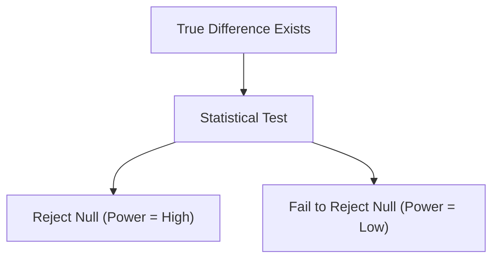
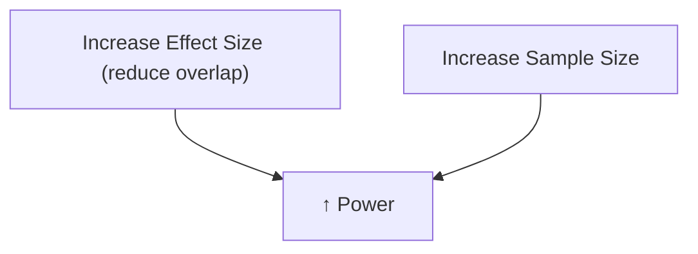
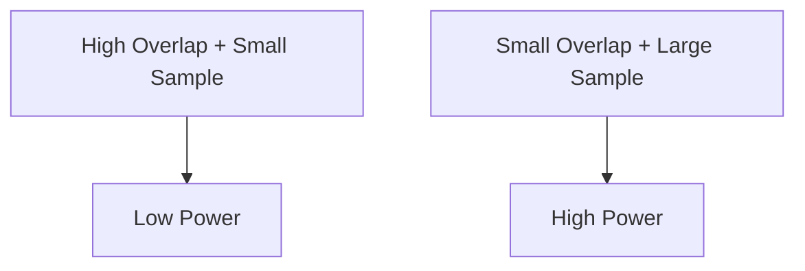

---
title:
  Power Analysis — Determining Sample Size and Understanding Statistical Power
sidebar_position: 83
---

# Understanding Power Analysis

---

## Introduction

In this StatQuest, we dive into **statistical power** and how to perform a
**power analysis** to determine the correct sample size for experiments.  
Power analysis is essential to avoid **P-hacking** and ensure that your study
can correctly detect real effects when they exist.

---

## Why We Do a Power Analysis

Imagine two drugs, **Drug A** and **Drug B**, developed to treat a virus.  
We test them on small groups and measure **recovery times**.

| Group  | Recovery Days | Mean |
| ------ | ------------- | ---- |
| Drug A | 3, 4, 5       | 4.0  |
| Drug B | 5, 6, 7       | 6.0  |

The p-value comparing means is **0.06** (just above 0.05).  
It’s tempting to “add one more person per group” — but that would be
**P-hacking**.

Instead, we perform a **power analysis** to plan the correct sample size before
the next experiment.

---

## Definition

> **Power analysis** determines the minimum sample size required to have a high
> probability of correctly rejecting the null hypothesis if a true effect
> exists.

---

## Concept of Statistical Power

### What Is Power?

**Power = Probability of correctly rejecting the null hypothesis.**

It measures how likely our test will detect a true difference when one exists.

- High power → Small chance of missing a real effect (low false negatives).
- Low power → Large chance of missing a real effect.


````

---

### Example: Two Distributions

Let’s compare two distributions:

- Left: mice on **special diet**
- Right: mice on **normal diet**


The means differ clearly, and overlap is small → p-value = 0.0004 → We
**correctly reject** the null hypothesis.

Hence, the **power is high**.

---

### When Power Is Low

If the two distributions overlap heavily:


Even though there is a true difference, small samples (like 3 per group) yield p
≈ 0.34, so we **fail to reject** the null hypothesis.

In repeated experiments, most p-values will be large, and only rarely will we
detect the true difference.

Thus, **power is low**.

---

## Two Main Factors Affecting Power

| Factor                       | Explanation                                        |
| ---------------------------- | -------------------------------------------------- |
| **1. Effect Size / Overlap** | Larger difference (smaller overlap) → higher power |
| **2. Sample Size**           | More samples per group → higher power              |



---

## Why Sample Size Matters

When we increase the number of measurements per group, our estimates of the
**population mean** become more accurate.

### One Measurement per Group

High variation in estimated means → low confidence → large p-values.


---

### Two Measurements per Group

Extreme values average out, reducing variability in the estimated mean.


Now, the estimated means are **closer to the true mean** → increased confidence.

---

### Ten Measurements per Group

With 10 samples, the estimated means for each group become **very close** to
population means, and distributions no longer overlap.


Result → p-values become small → **power is high**.

✅ Even if distributions overlap, sufficient sample size ensures correct
detection.

---

## The Math Behind Power Analysis

To perform a power analysis, we need three parameters:

| Parameter    | Symbol | Typical Value | Description                                 |
| ------------ | ------ | ------------- | ------------------------------------------- |
| Power        | 1 - β  | 0.8           | Probability of correctly rejecting the null |
| Significance | α      | 0.05          | Threshold for rejecting the null hypothesis |
| Effect Size  | d      | Calculated    | Standardized difference between means       |

---

### Effect Size (Cohen’s d)

The **effect size** combines the difference in means and pooled standard
deviation:

$$
d = \frac{|\bar{X}_1 - \bar{X}_2|}{s_p}
$$

where

$$
s_p = \sqrt{\frac{s_1^2 + s_2^2}{2}}
$$

Example:

- Mean difference = 10
- Standard deviations = 7 and 6
- Pooled SD = √((7² + 6²)/2) = 6.5
- Effect size = 10 / 6.5 = **1.54**

A large effect size → fewer samples needed.

---

### Power Calculation

We now have:

- Desired Power = 0.8
- α = 0.05
- Effect size = 1.54

Using an online or statistical power calculator (like G\*Power):

✅ Required sample size per group = **9**

Meaning — **9 samples per group** ensures 80% probability of correctly rejecting
the null hypothesis.

---

## The Relationship Between Overlap, Sample Size, and Power



| Overlap Between Distributions | Sample Size | Power    |
| ----------------------------- | ----------- | -------- |
| Large overlap                 | Small       | Low      |
| Large overlap                 | Large       | Moderate |
| Small overlap                 | Small       | Moderate |
| Small overlap                 | Large       | High     |

---

## Summary

| Concept            | Explanation                                        |
| ------------------ | -------------------------------------------------- |
| **Power**          | Probability of correctly rejecting null hypothesis |
| **High Power**     | Detects true effects reliably                      |
| **Low Power**      | Misses true effects (false negatives)              |
| **Effect Size**    | Quantifies overlap between groups                  |
| **Sample Size**    | Increasing samples increases power                 |
| **Power Analysis** | Calculates required sample size before testing     |

---

## Best Practices

✅ Choose desired **power** (e.g., 0.8). ✅ Set **α = 0.05** or stricter if
needed. ✅ Estimate **effect size** from pilot or literature data. ✅ Use
**power calculators** to determine sample size. ✅ Avoid **P-hacking** by
deciding sample size _before_ data collection.

---

> **Key Takeaway:** Power analysis ensures your experiment is large enough to
> detect meaningful effects without bias or manipulation. It’s a statistical
> safeguard against false conclusions.

---

<iframe width="100%" height="615" src="https://www.youtube.com/embed/VX_M3tIyiYk?si=pDRxFmY20kbZ_7W-" title="StatQuest: Power Analysis" frameborder="0" allow="accelerometer; autoplay; clipboard-write; encrypted-media; gyroscope; picture-in-picture; web-share" referrerpolicy="strict-origin-when-cross-origin" allowfullscreen></iframe>

---
