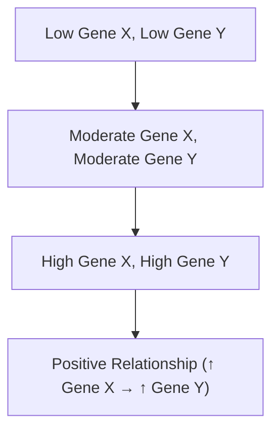
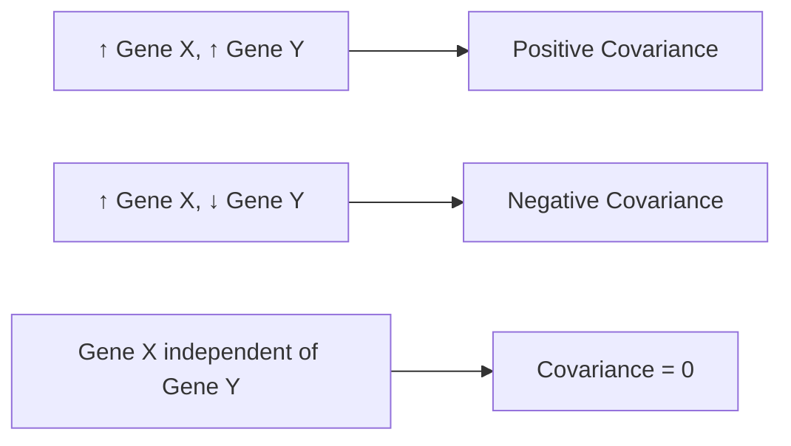
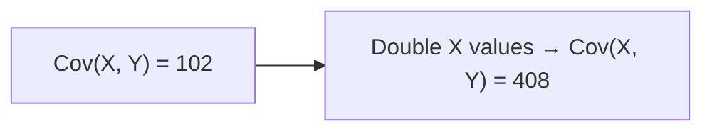

# Covariance — Understanding Relationships Between Variables

---

## Introduction

**Covariance** is a statistical concept that measures how two variables change
**together**.  
If they increase or decrease in the same direction, the covariance is
**positive**.  
If one increases while the other decreases, it’s **negative**.  
If they’re unrelated, the covariance is **zero**.

It’s a crucial foundation for understanding **correlation** and advanced
techniques like **Principal Component Analysis (PCA)**.

---

## Review — What Is Variance?

Before we get to covariance, let’s recall **variance**.

Variance measures how spread out the data is around the mean.

$$
Var(X) = \frac{\sum{(x_i - \bar{x})^2}}{n - 1}
$$

Example: Counting mRNA transcripts for **Gene X** in 5 cells.

| Cell | Gene X Count |
| ---- | ------------ |
| 1    | 12           |
| 2    | 15           |
| 3    | 18           |
| 4    | 20           |
| 5    | 23           |

The **mean** number of transcripts for Gene X is $\bar{x} = 17.6$.

---

## Motivation for Covariance

Now we also measure **Gene Y** transcripts in the _same_ five cells.

| Cell | Gene X | Gene Y |
| ---- | ------ | ------ |
| 1    | 12     | 15     |
| 2    | 15     | 18     |
| 3    | 18     | 21     |
| 4    | 20     | 24     |
| 5    | 23     | 27     |

When Gene X values are high, Gene Y values are also high — they seem to move
**together**.

This is where **covariance** comes in: it quantifies this relationship.

---

### Visualizing Paired Data

The trend line shows a **positive slope**, meaning both variables increase
together.

---

## Types of Covariance Relationships

| Covariance Value | Relationship Type     | Interpretation                               |
| ---------------- | --------------------- | -------------------------------------------- |
| Positive (+)     | Positive Relationship | Both variables increase or decrease together |
| Negative (–)     | Negative Relationship | One increases while the other decreases      |
| Zero (0)         | No Relationship       | No consistent trend between variables        |

### Examples

---

## The Formula for Covariance

The covariance between **X** and **Y** is calculated as:

$$
Cov(X, Y) = \frac{\sum{(x_i - \bar{x})(y_i - \bar{y})}}{n - 1}
$$

Where:

- $x_i$ = Each value of X
- $y_i$ = Each value of Y
- $\bar{x}$, $\bar{y}$ = Their respective means
- $n$ = Number of observations

---

### Intuitive Breakdown

Let’s interpret the term $(x_i - \bar{x})(y_i - \bar{y})$:

| Case                 | $x_i - \bar{x}$ | $y_i - \bar{y}$ | Product | Contribution |
| -------------------- | --------------- | --------------- | ------- | ------------ |
| Both above mean      | +               | +               | +       | Positive     |
| Both below mean      | –               | –               | +       | Positive     |
| One above, one below | +               | – or –          | +       | Negative     |
| Opposite signs       | –               | +               | –       | Negative     |

When both deviations have **the same sign**, covariance is **positive**.

---

## Example: Positive Covariance

| Cell | Gene X | Gene Y | $(x_i - \bar{x})(y_i - \bar{y})$ |
| ---- | ------ | ------ | -------------------------------- |
| 1    | 12     | 15     | (+)(+) = +                       |
| 2    | 15     | 18     | (+)(+) = +                       |
| 3    | 18     | 21     | (+)(+) = +                       |
| 4    | 20     | 24     | (+)(+) = +                       |
| 5    | 23     | 27     | (+)(+) = +                       |

Summing and dividing by (n–1):

$$
Cov(X, Y) = 116
$$

✅ **Interpretation:** Positive covariance indicates a **positive trend**.

---

## Example: Negative Covariance

If Gene Y values were inverted:

| Cell | Gene X | Gene Y | $(x_i - \bar{x})(y_i - \bar{y})$ |
| ---- | ------ | ------ | -------------------------------- |
| 1    | 12     | 28     | –                                |
| 2    | 15     | 24     | –                                |
| 3    | 18     | 20     | –                                |
| 4    | 20     | 16     | –                                |
| 5    | 23     | 12     | –                                |

$$
Cov(X, Y) = -105.15
$$

✅ **Interpretation:** When one gene increases while the other decreases,
covariance is **negative**.

---

## Example: Zero Covariance

If every Gene Y value is the same (say 20 for all cells):

| Cell | Gene X | Gene Y |
| ---- | ------ | ------ |
| 1    | 12     | 20     |
| 2    | 15     | 20     |
| 3    | 18     | 20     |
| 4    | 20     | 20     |
| 5    | 23     | 20     |

All deviations in Y are **zero**, so:

$$
Cov(X, Y) = 0
$$

✅ **Interpretation:** There is **no relationship** between X and Y.

---

## Why Covariance Is Hard to Interpret

Covariance values depend on **the scale of measurement**.

For example, if we double all X values, covariance becomes **4× larger**, even
though the relationship is the same.

### Key Takeaway

Covariance:

- Shows direction of relationship (positive/negative/none)
- Does **not** tell you **how strong** that relationship is
- Changes with **unit scaling**

That’s why we use **correlation**, which normalizes covariance — covered in
Part 2.

---

## Mathematical Connection: Covariance and Variance

If we calculate covariance of a variable **with itself**:

$$
Cov(X, X) = Var(X)
$$

So, variance is just a **special case of covariance** where both variables are
the same.

---

## Applications

Covariance is a **building block** for many advanced statistical tools:

- **Correlation Coefficients** (Standardized measure of relationship strength)
- **Principal Component Analysis (PCA)** (Uses covariance matrix to identify
  directions of maximum variance)
- **Portfolio Risk in Finance** (Covariance between stock returns)

---

## Summary

| Concept                     | Description                              |
| --------------------------- | ---------------------------------------- |
| **Covariance**              | Measures how two variables vary together |
| **Positive Covariance**     | Both increase or decrease together       |
| **Negative Covariance**     | One increases while the other decreases  |
| **Zero Covariance**         | No relationship between variables        |
| **Sensitive to Scale**      | Changes with unit of measurement         |
| **Step Toward Correlation** | Correlation removes scale dependency     |

---

## Key Insight

> Covariance tells us **the direction** of a relationship. Correlation tells us
> **the strength** of that relationship.

---

<iframe width="100%" height="615" src="https://www.youtube.com/embed/qtaqvPAeEJY?si=KOGw8Ligr0xhy2Gd" title="YouTube video player" frameborder="0" allow="accelerometer; autoplay; clipboard-write; encrypted-media; gyroscope; picture-in-picture; web-share" referrerpolicy="strict-origin-when-cross-origin" allowfullscreen></iframe>
