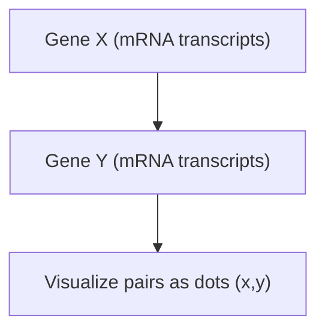
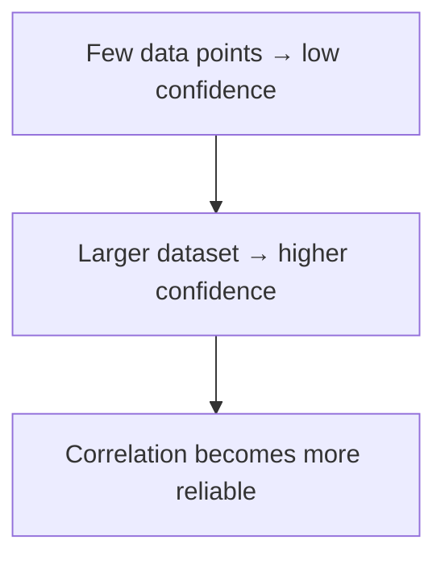

# Understanding Correlation

---

## Introduction

In this lesson, we continue from **Covariance (Part 1)** and learn how to
measure the **strength and direction** of relationships between two variables
using **correlation**.  
While covariance only tells whether the trend is _positive_ or _negative_,
**correlation** tells _how strong_ that trend is — and removes the effect of
scale.

---

## Motivation for Correlation

Let’s imagine we measure **Gene X** and **Gene Y** expression across five cells.

Alternatively, you can think of:

- X = number of green apples in a store
- Y = number of red apples in the same store

Plotting these pairs gives us a pattern:

- Low X → low Y
- High X → high Y

This positive trend can be represented by a line with **positive slope**.

---

## Visualizing Correlation Strength

Below are three scatterplots showing different relationship strengths.

- When dots are **close to the line**, correlation is **strong**.
- When dots are **farther**, correlation is **weak**.

---

## Correlation vs. Causation

Correlation shows **association**, not **cause**.

- ✅ “High Gene X values occur with high Gene Y values.”
- ❌ “Gene X causes Gene Y to increase.”

There might be a **third variable** influencing both.

---

## Range of Correlation Values

| Correlation (r) | Meaning                              |
| --------------- | ------------------------------------ |
| +1              | Perfect positive linear relationship |
| 0               | No linear relationship               |
| –1              | Perfect negative linear relationship |

---

## Mathematical Definition

For two variables X and Y:

$[ r = \frac{\text{cov}(X, Y)}{\sqrt{\text{var}(X) \times \text{var}(Y)}} ]$

- The **numerator** (covariance) can be any number from −∞ to +∞
- The **denominator** scales it between −1 and +1
- Resulting _r_ is **unitless**, independent of scale

---

## Positive, Negative, and Zero Correlation

### Positive Correlation (r > 0)

As X increases, Y increases.

### Negative Correlation (r < 0)

As X increases, Y decreases.

### Zero Correlation (r ≈ 0)

No clear linear pattern.

---

## Why Correlation Removes Scale

Correlation divides the covariance by the product of the standard deviations of
X and Y. This means doubling or changing the unit (e.g., cm → m) will not change
_r_.

---

## Example Calculation

| Sample |  X  |  Y  |
| :----: | :-: | :-: |
|   1    | 12  | 15  |
|   2    | 14  | 18  |
|   3    | 18  | 22  |
|   4    | 20  | 25  |
|   5    | 22  | 28  |

- Cov(X, Y) = 116
- Var(X) = 101.8
- Var(Y) = 160.3

$[ r = \frac{116}{\sqrt{101.8 \times 160.3}} = 0.9 ]$

✅ **Strong positive correlation**

---

## Correlation and p-value

A correlation’s **p-value** tells how likely it is to see such a relationship by
**chance**.

| p-value  | Interpretation                                     |
| -------- | -------------------------------------------------- |
| p < 0.05 | Statistically significant (unlikely due to chance) |
| p > 0.05 | Not significant (could be random)                  |

Smaller p ⇒ greater confidence.

---

## Confidence and Sample Size

With only two points, correlation is ±1 by definition — but meaningless. The
**more data** you collect, the more reliable _r_ becomes.

---

## Correlation vs. R²

| Metric              | Meaning                                       |
| ------------------- | --------------------------------------------- |
| **Correlation (r)** | Strength & direction of a linear relationship |
| **R² = r²**         | Proportion of variation in Y explained by X   |

For example, if r = 0.9 → R² = 0.81, meaning 81% of Y’s variation can be
explained by X.

---

## Summary

| Concept               | Explanation                                     |
| --------------------- | ----------------------------------------------- |
| **Correlation range** | −1 to +1                                        |
| **r > 0**             | Positive relationship                           |
| **r < 0**             | Negative relationship                           |
| **r ≈ 0**             | No linear relationship                          |
| **Scale-independent** | Units don’t affect correlation                  |
| **R²**                | Measures how much of Y’s variation X explains   |
| **p-value**           | Confidence that correlation isn’t due to chance |

---

## Practice Questions

1. What does a correlation of 0.85 mean? → Strong positive relationship.

2. If r = −0.95, what’s R²? → 0.90 → strong negative linear fit.

3. If correlation = 0, does that mean variables are unrelated? → Only _linearly_
   unrelated — nonlinear relationships may still exist.

4. What happens to correlation when you double all X values? → No change —
   correlation is unitless.

5. What does a small p-value mean for correlation? → It’s statistically
   significant — unlikely to be due to random chance.

---

## Key Takeaway

> **Correlation quantifies how strongly two variables move together, without
> being affected by scale.** It tells us _how_ X and Y move, not _why_ —
> correlation is not causation.

---

<iframe width="100%" height="615" src="https://www.youtube.com/embed/xZ_z8KWkhXE?si=GbebLDHytp2swad0" title="Correlation — StatQuest" frameborder="0" allow="accelerometer; autoplay; clipboard-write; encrypted-media; gyroscope; picture-in-picture; web-share" allowfullscreen></iframe>
